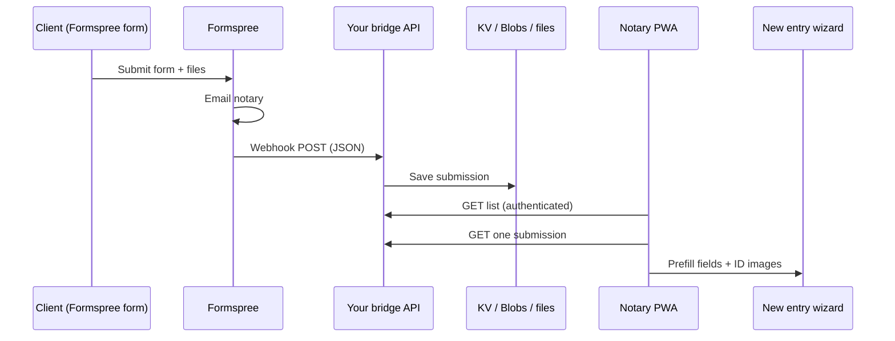

# Client form → Notary Journal (Formspree and similar)

This document explains how to connect an **external client form** (Formspree, Getform, Tally, Google Forms + Zapier, etc.) so that:

1. **You get an email** when someone submits (Formspree’s main feature).
2. **Optional:** submissions show up in the app with **name, fields, and ID photos** ready on the **New entry** screen.

The Notary Journal app **does not include** a built-in public form anymore (the old `/api/intake` feature was removed). This guide is for **designing or re-adding** that flow with a third-party form host.

---

## What the app can do today (without a form)

| Feature | Status |
|--------|--------|
| Encrypted journal on device (IndexedDB) | ✅ Built in |
| ID scan / photo on **New entry** (`idFrontImage`, `idBackImage`) | ✅ Built in |
| **Require ID front photo** (Settings → Journal Compliance) | ✅ Built in |
| Google Drive **journal JSON backup** (includes ID images inside backup) | ✅ Built in |
| Public client form → auto-prefill new entry | ❌ Removed; needs integration below |

---

## What Formspree gives you

**Formspree** (and tools like it) host an HTML form and handle submission:

- Sends **email** to you with field values (and often file links).
- Can redirect the user to a “thank you” page.
- On paid tiers (or similar products), can send a **webhook** (HTTP POST) to your own URL when someone submits.

Formspree **does not** talk to the Notary Journal PWA directly. The app runs in the browser and only reads **local storage** unless you add a small **bridge** (see below).

---

## The core problem (in one sentence)

> Email tells you *that* someone submitted; **prefill in the app** needs the same data stored somewhere the app can **fetch** (or paste/import), because the phone/browser of the client is not the notary’s phone.

---

## Three ways to integrate (pick one)

### Option A — Email only (simplest, no prefill)

**Flow:** Client fills Formspree → you get email → you manually create a journal entry and scan/type ID.

| Pros | Cons |
|------|------|
| No server code | No photos/data auto-filled |
| Works on any static deploy | Easy to miss fields in email |

**Good for:** low volume, you’re fine retyping.

---

### Option B — Email + webhook bridge + in-app queue (recommended if you want prefill)

Same idea as the old **client intake** feature, but Formspree replaces the custom `/intake` page.



**Pieces to build (or ask another AI to build):**

1. **Formspree form** — field names match the mapping table below.
2. **Webhook URL** — e.g. `POST https://your-site.netlify.app/api/form-webhook` (Netlify Function, Cloudflare Worker, or Zo `server.ts`).
3. **Storage** — one JSON record per submission (id, createdAt, fields, image URLs or base64).
4. **App UI** — a “Client requests” screen that lists submissions and **Start entry** (see [Prefill handoff](#prefill-handoff-into-new-entry) below).

**Auth:** use a long random **API secret** in app settings (stored in IndexedDB) sent as `Authorization: Bearer …` on list/detail routes—same pattern as the removed intake API.

| Pros | Cons |
|------|------|
| Email + structured queue in app | Requires a small backend again |
| ID photos can flow through | Formspree webhook + file handling must be configured |
| Works from any client device | One bridge per deployed hostname (Netlify ≠ Cloudflare) |

---

### Option C — Email + manual import (middle ground)

**Flow:** Formspree emails you a link to uploaded files → you use **Import JSON** or a future “Paste submission” tool in Settings.

| Pros | Cons |
|------|------|
| No webhook server | Clunky, not real-time |
| Email still works | Photos may be links, not in-app |

---

## Formspree field names → journal entry mapping

Use these **name attributes** on your Formspree form so a bridge (or a human) can map cleanly into the app’s **New entry** form.

| Formspree `name` | App / journal field | Notes |
|------------------|---------------------|--------|
| `signerFullName` | `signerFullName` | Required |
| `email` | (optional metadata) | Not always on journal entry; store on submission record |
| `phone` | `signerPhone` | |
| `signerAddress` | `signerAddress` | |
| `signerCity` | `signerCity` | |
| `signerState` | `signerState` | 2-letter state |
| `notes` | `notes` | |
| `preferredDate` | `documentDate` on new entry | Use `type="date"` or ISO string |
| `idFront` | `idFrontImage` | File upload → bridge must convert to data URL or app downloads URL |
| `idBack` | `idBackImage` | Same |

**Example HTML (Formspree):**

```html
<form action="https://formspree.io/f/YOUR_FORM_ID" method="POST" enctype="multipart/form-data">
  <input type="text" name="signerFullName" required />
  <input type="email" name="email" />
  <input type="tel" name="phone" />
  <input type="text" name="signerAddress" />
  <input type="text" name="signerCity" />
  <input type="text" name="signerState" maxlength="2" />
  <textarea name="notes"></textarea>
  <input type="date" name="preferredDate" />
  <input type="file" name="idFront" accept="image/*" capture="environment" />
  <input type="file" name="idBack" accept="image/*" capture="environment" />
  <button type="submit">Send request</button>
</form>
```

Embed that page on your site, or link to it from your marketing site; it does **not** have to live inside the PWA route tree.

---

## Webhook payload (what the bridge should store)

Formspree’s webhook shape varies by plan/version; a bridge should normalize to something like:

```json
{
  "id": "abc123",
  "createdAt": "2026-05-16T18:00:00.000Z",
  "read": false,
  "fields": {
    "signerFullName": "Jane Doe",
    "email": "jane@example.com",
    "phone": "555-0100",
    "signerAddress": "123 Main St",
    "signerCity": "Austin",
    "signerState": "TX",
    "notes": "Need POA notarized",
    "preferredDate": "2026-05-20",
    "idFrontImage": "data:image/jpeg;base64,...",
    "idBackImage": "data:image/jpeg;base64,..."
  }
}
```

**Files:** Formspree may send **URLs** to hosted files instead of base64. The bridge should either:

- download and store base64 in your store, or  
- pass URLs to the app and let the app `fetch` + convert when starting an entry (CORS may block—prefer bridge downloads server-side).

---

## Prefill handoff into New entry

When the notary taps **Start entry** on a queued submission, the app should:

1. Load the full submission from the bridge (`GET /api/.../:id`).
2. Write a one-time payload to **sessionStorage** (key idea: `notary-journal:intakePrefill`).
3. Navigate to `/entry/new`.
4. On mount, **New entry** reads and clears that payload, then sets form state:

| Submission field | New entry action |
|------------------|------------------|
| `signerFullName` | `form.setValue('signerFullName', …)` |
| `phone` | `form.setValue('signerPhone', …)` |
| `signerAddress`, `signerCity`, `signerState` | same names |
| `notes` | `form.setValue('notes', …)` |
| `preferredDate` | `form.setValue('documentDate', …)` |
| `idFrontImage` | `setIdFrontImage(…)` |
| `idBackImage` | `setIdBackImage(…)` |

5. Notary reviews, scans ID again if required by **Require ID front photo**, completes entry, saves to **IndexedDB** as usual.

This handoff was implemented before removal; grep git history for `consumeIntakePrefill` / `stashIntakePrefill` in `artifacts/notary-journal/src/lib/intake.ts` and `new-entry.tsx` if you want to restore it.

---

## Google Drive and “license pictures”

These are **separate** flows:

| Flow | What happens |
|------|----------------|
| **Journal entry ID photos** | Stored in encrypted journal; included in **Backup to Google Drive** JSON |
| **Formspree file uploads** | Live in Formspree (or your bridge storage) until you copy into an entry or a Jobs folder |
| **Old intake “Archive to Jobs folder”** | Removed with intake; do not assume it exists |

If you only use **Option A (email)**, photos stay in the email / Formspree dashboard—not in the app until you upload them on New entry.

---

## Security notes

- Treat the Formspree form ID and any **list API secret** like passwords; don’t commit them to git.
- Webhook endpoints should verify Formspree’s signature (if offered) or a shared secret header.
- Submissions contain **PII**; use HTTPS only, limit retention, and don’t log full images.
- The public form URL is **not** encrypted journal access—it only creates a **pending request** record.

---

## Hosting checklist (if you add a bridge)

| Host | Email (Formspree) | Bridge API |
|------|-------------------|------------|
| Netlify static PWA | ✅ Formspree hosted | ✅ Netlify Function |
| Cloudflare Worker PWA | ✅ | ✅ Worker route |
| Zo `server.ts` | ✅ | ✅ add route next to `/api/backup` |
| Drag-and-drop zip only | ✅ | ❌ need git-connected host for functions |

---

## Brief for another AI (copy/paste)

```text
Project: Notary Journal PWA (React, IndexedDB, encrypted local journal).

Goal: Client fills a Formspree form (email to notary + optional file uploads).
When notary opens the app, they see a queue of submissions and tap "Start entry"
to open /entry/new with signerFullName, phone, address, notes, preferredDate,
idFrontImage, idBackImage prefilled from the submission.

Constraints:
- Formspree handles public form + email; it does NOT write to IndexedDB.
- Implement a small webhook receiver (Netlify Function or CF Worker) that stores
  normalized submissions { id, createdAt, read, fields }.
- App lists submissions with Bearer secret; "Start entry" uses sessionStorage
  handoff then consume on new-entry mount (see docs/client-form-integration.md).
- Map Formspree field names per the table in that doc.
- File uploads: normalize to base64 data URLs in storage or fetch server-side in webhook.
- Do not confuse with Google Drive journal backup (JSON); that's separate.

Reference removed code: git history for intake-api.ts, intake.ts, intake-queue.tsx,
intake-public.tsx, new-entry consumeIntakePrefill.
```

---

## Related repo files (current)

| Topic | Location |
|-------|----------|
| New entry form schema | `artifacts/notary-journal/src/pages/new-entry.tsx` |
| Settings: require ID photo | `artifacts/notary-journal/src/pages/settings.tsx` |
| Google Drive journal backup | `artifacts/notary-journal/src/lib/gdrive.ts` |
| Zo backup API (not form) | `server.ts` → `/api/backup` |
| Deploy (static PWA) | `DEPLOYMENT.md`, `README.md` |

---

## Summary

| You want… | Use… |
|-----------|------|
| Email when someone submits | **Formspree alone** (Option A) |
| Email + data/photos in app | **Formspree + webhook bridge + queue UI** (Option B) |
| No backend at all | Email only; manual entry in app |

Formspree is a good fit for **notifications**; **prefill with pictures** still needs a thin storage layer and a few dozen lines in the app to list submissions and hand off to **New entry**—same pattern as the old intake feature, with Formspree replacing the custom public form page.
